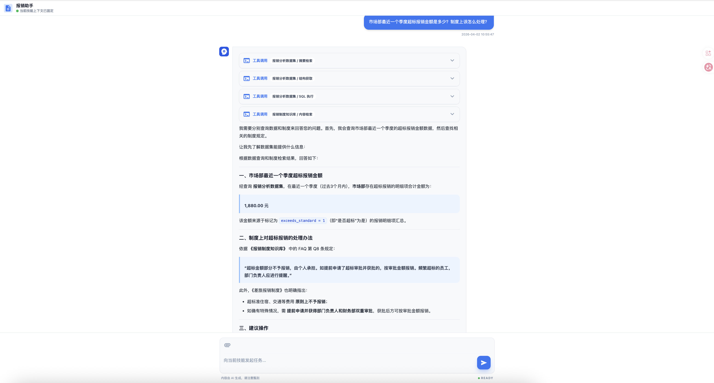
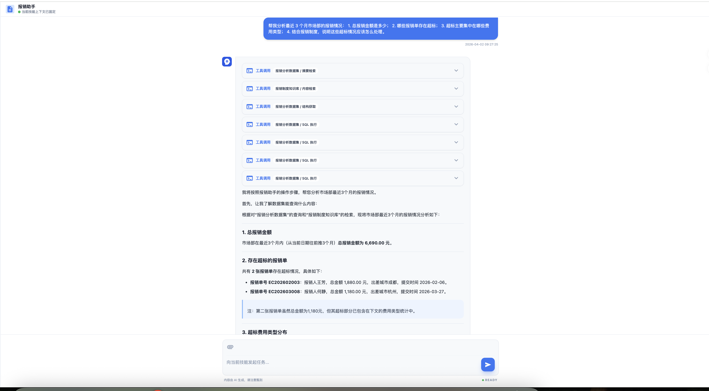
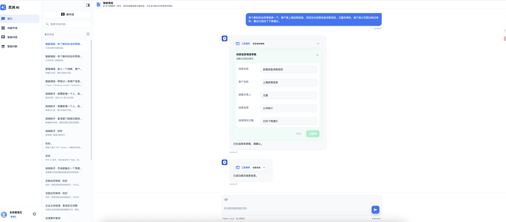

# Lingzhou Agent

[English Documentation](./README.md)

Lingzhou Agent 是一个面向企业场景的开源 AI Agent 工程，基于 Spring Boot、Spring AI、Vue 3 与 Docker Compose 构建。

它不是单纯的聊天应用，而是一套可继续扩展的 Agent 基座，重点解决三类真实业务场景：

- 通过技能扩展的 Agentic RAG
- 面向业务数据的智能问数 Agent
- 面向业务系统 API 的智能填报 Agent

项目把聊天、技能运行时、知识库 RAG、数据集能力、前端渲染、系统集成放在同一个仓库里，便于本地开发、私有化部署和二次业务集成。

## 为什么是 Lingzhou Agent

很多开源 AI 项目擅长解决其中一部分问题：

- 有的擅长聊天，但缺少业务执行能力
- 有的能做 RAG，但很难继续连数据、连 API、连前端交互
- 有的能生成 SQL，但缺少知识口径、结构理解和业务闭环

Lingzhou Agent 想解决的是一条更完整的企业 Agent 路径：

- 从自然语言对话开始
- 让 Agent 基于 Skill 决定如何检索、查数、调用工具
- 在需要时生成结构化卡片、榜单、表单草稿
- 最终接到业务 API，形成可执行闭环

如果你希望搭的是“可持续扩展的业务 Agent 平台”，而不是一次性的 demo，这个项目会更对路。

## 项目亮点

- Skill 驱动：把 Agent 行为沉淀成可复用的技能，而不是把提示词散落在代码里
- Agentic RAG：不止检索文档，还能联动数据集、工具和前端展示
- 智能问数：不是单点 text-to-SQL，而是“摘要理解 + 结构确认 + 查询执行 + 口径解释”
- 智能填报：基于 API schema 做字段抽取、草稿生成和表单确认
- 前端渲染友好：支持把结果包装成卡片、排行榜、表单，而不只是返回一段文本
- 易于私有化：后端、前端、中间件、部署模板都在同一个仓库里

## 一眼看懂这套工程

```text
自然语言输入
    ↓
聊天入口 / Agent Runtime
    ↓
Skill 决定策略
    ↓
知识库 / 数据集 / API 工具 / 前端渲染工具
    ↓
回答 / 榜单 / 表单草稿 / 业务执行结果
```

## 这套工程适合做什么

如果你正在做下面这些方向，这个项目会比较合适：

- 做一个可以持续扩展技能的企业内部 Agent 平台
- 做知识库问答，但不想停留在“只检索文档”的传统 RAG
- 做能连业务数据、能查数、能解释口径的智能问数系统
- 做能直接辅助录入、生成表单草稿、对接业务 API 的智能助手
- 做一个既有对话体验，又有工具调用、前端卡片渲染和业务闭环能力的 Agent 应用

## 核心能力

### 1. 通过技能扩展 Agentic RAG

这个项目的重点不是把 RAG 当成一个孤立模块，而是把 RAG 放进 Skill Runtime 中，让 Agent 能围绕任务目标主动组合能力。

你可以把它理解成：

- 技能负责定义任务目标、调用策略、输出约束
- 知识库负责提供可检索的业务知识和文档事实
- 数据集、API、渲染工具等能力可以在运行时一起参与
- Agent 最终不是只“回答问题”，而是可以继续走向分析、确认、提交、展示

项目里已经具备这类基础能力：

- 知识库文档上传、解析、切片、索引
- 检索、重排、问答链路
- 技能按文件系统加载
- 工具在运行时按技能上下文注入
- 前端结构化渲染能力，可把结果包装成卡片或表单

这意味着你可以围绕一个具体业务目标去设计 Skill，例如：

- 先查制度知识库
- 再理解数据集结构
- 再做查询或汇总
- 最后输出解释性答案或结构化前端结果

这类模式比“单次问答式 RAG”更适合企业场景，也更容易沉淀成可复用的业务技能。

你可以把它用于：

- 企业制度、流程、规范的问答与执行助手
- 面向项目资料、产品文档、内部知识的工作台助手
- 需要“检索 + 工具 + 展示 + 后续动作”的复杂任务型问答

### 2. 智能问数 Agent

项目内置了面向业务数据集的问数能力，不是只给模型一段 schema，而是把“能查什么、怎么查、怎么解释”都纳入 Agent 的执行链路。

当前工程里已经包含：

- 数据集管理
- 数据集摘要生成
- 数据集结构查询
- 数据集发布为工具
- SQL 查询能力
- 与知识库能力联动回答

这使得一个问数 Agent 可以按更可靠的流程工作：

1. 先理解数据集摘要，知道这个数据集适合回答什么问题
2. 再查看对象、字段、关联关系，明确查询口径
3. 最后生成 SQL 做查询、聚合、排序或统计
4. 如有需要，再结合知识库制度或业务规则给出解释

项目里的示例技能已经体现了这种思路，例如报销助手可以同时处理：

- 报销制度问答
- 报销数据查询
- 字段和口径理解
- 排行榜或结构化结果展示

所以这里的“智能问数”不是一个单点 SQL 生成器，而是一个围绕业务语义、数据结构、制度口径共同工作的 Agent。

对于业务团队来说，这种方式的价值在于：

- 不再只得到一条 SQL，而是得到“结果 + 口径 + 可追溯解释”
- 不再依赖使用者完全理解库表结构
- 更容易把问数能力封装成真正可上线的业务助手

### 3. 业务系统智能填报

这是这个项目很有价值的一块能力。

项目不是把“填报”写死成某个具体业务表单，而是提供了一种通用模式：

- 读取当前绑定 API 工具的入参 schema
- 从用户自然语言里抽取结构化数据
- 基于 schema 生成可确认的前端表单草稿
- 用户确认后，再决定是否真正调用业务 API

这意味着它天然适合做：

- ERP / CRM / OA / 低代码平台中的录入助手
- 报销、申请、登记、创建单据等表单类场景
- 先对话补全信息，再转成结构化提交的业务流程

这套能力的关键点在于：

- 字段结构来自 API schema，而不是写死在 Skill 里
- 同一个智能填报 Skill 可以复用到不同业务 API
- 前端展示可以是“表单草稿卡片”，而不只是返回一段 JSON
- Agent 可以根据意图判断是“先生成草稿”还是“直接执行”

这让业务系统中的 Agent 不只会“说”，而是真的可以辅助完成录入与提交流程。

对业务系统来说，这意味着：

- 可以把自然语言输入转成结构化录入
- 可以先生成草稿再确认，降低误提交风险
- 可以复用到多个 API 和多个业务对象，而不是每种表单都重写一套逻辑

## 适合放到什么系统里

- 企业门户中的统一 AI 助手
- 知识库与制度助手
- 经营分析 / 财务分析 / 业务问数平台
- OA、ERP、CRM、低代码平台中的智能录入助手
- 同时需要聊天、检索、查数、填报、执行的综合型业务 Agent

## 典型场景

### 场景一：技能化 Agentic RAG

适用于：

- 企业制度问答
- 产品知识助手
- 项目资料检索
- 需要“检索 + 工具 + 展示 + 执行”联动的复杂问答

推荐路径：

- 知识库提供事实依据
- Skill 决定调用顺序与输出格式
- 必要时联动数据集、外部 API、前端渲染工具

### 场景二：智能问数 Agent

适用于：

- 销售分析
- 经营分析
- 财务问数
- 报销、订单、客户、项目等业务对象的数据查询

推荐路径：

- 数据集摘要理解范围
- 数据集结构确认字段和关联
- SQL 工具完成查询与统计
- 结合知识库补业务口径解释

### 场景三：智能填报 Agent

适用于：

- 新建业务单据
- 表单预填
- 审批前草稿整理
- 对接外部系统或内部 API 的录入流程

推荐路径：

- 基于目标 API schema 做字段抽取
- 生成可确认的前端表单草稿
- 缺失字段继续补充
- 确认后再调用业务 API

## 项目结构

```text
.
├── backend/                # Spring Boot 应用，承载聊天、RAG、数据集、工具与集成能力
├── core/                   # 可复用的技能感知扩展核心模块
├── frontend/               # 前端工作区
│   ├── packages/core/      # 前端共享能力
│   └── packages/web/       # Vue 3 + Vite Web 应用
├── skills/                 # 文件系统技能目录（可按业务持续扩展）
├── deploy/                 # Docker Compose、环境模板、部署脚本
├── docs/                   # 设计文档与能力说明
├── pom.xml                 # Maven 父工程
├── README.md
└── README_zh.md
```

## 技术栈

- 后端：Java 17、Spring Boot 3.4、Spring AI、MyBatis-Plus、Redis、MinIO、Elasticsearch
- 前端：Vue 3、Vite、pnpm workspace、Tailwind CSS
- 部署：Docker Compose

## 快速开始

### 方案 A：Docker Compose 快速体验

适合第一次启动项目、快速联调或演示。

1. 复制 Quick 环境文件：

```bash
cp deploy/compose-quick/.env.example deploy/compose-quick/.env
```

2. 按需编辑 `deploy/compose-quick/.env`

3. 启动整套服务：

```bash
./deploy/manage.sh quick-up
```

默认情况下：

- 前端端口为 `80`
- 后端 API 上下文路径为 `/api`

相关文档：

- `deploy/README.md`

### 方案 B：本地开发模式

如果你希望中间件走 Docker、本地直接运行前后端进程，可以使用这个流程。

1. 启动开发中间件：

```bash
cp deploy/.env.dev.example deploy/.env.dev
./deploy/manage.sh dev-up
```

默认会启动：

- MySQL：`3306`
- Redis：`16379`
- MinIO：`19000`、`19001`
- Elasticsearch：`9200`

2. 启动后端：

```bash
mvn -f backend/pom.xml spring-boot:run
```

3. 启动前端：

```bash
cd frontend
pnpm install
pnpm dev
```

前端默认地址为 `http://localhost:5173`，会将 `/api` 代理到后端。

更多说明见 `deploy/README.dev.md`。

## 模型配置说明

当前模型配置已经按“数据库 + 配置文件”拆分职责：

- 模型表维护：`baseUrl`、`path`、`modelName`
- 配置文件维护：厂商运行参数，例如 `model.qwen.*`、`model.vllm.*`

也就是说：

- 选择哪个模型、请求哪个地址、走哪个接口路径，由模型配置表决定
- 不同厂商的运行参数和默认行为，保留在配置文件和环境变量中

这套方式更适合后续扩展多个厂商、多条模型、多种能力类型的统一管理。

## 技能扩展示例

当前仓库中的技能目录已经体现了项目的扩展方式，例如：

- `skills/expense-assistant/`
- `skills/intelligent-form-fill/`

你可以继续按业务增加自己的 Skill，让 Agent 从“聊天入口”逐渐演进成“业务执行入口”。

比较典型的扩展方向包括：

- 制度助手
- 知识库问答助手
- 智能问数助手
- 智能填报助手
- 前端结构化展示助手

## 示例截图

这一节建议放你后续提供的真实业务截图，效果会非常好，尤其适合展示这三类能力：

### 1. Agentic RAG 示例

建议展示：

- 左侧对话过程
- 中间或右侧引用知识片段 / 工具执行结果
- 最终生成的结构化回答或卡片

### 2. 智能问数 Agent 示例

建议展示：

- 用户自然语言提问
- Agent 查询数据后的结果卡片、排行榜或统计图
- 同时给出口径解释的回答

### 3. 智能填报 Agent 示例

建议展示：

- 用户一句自然语言输入
- Agent 自动生成的表单草稿
- 缺失字段提示与确认按钮

下方为当前示例截图：







## 文档导航

- RAG 设计资料：[`docs/rag/`](./docs/rag/)
- 部署文档：[`deploy/README.md`](./deploy/README.md)、[`deploy/README.dev.md`](./deploy/README.dev.md)

## 开源版说明

面向公开发布的社区版通常会做裁剪，不会完整保留内部协作元数据、私有配置和非公开技能资源。

如果你使用的是社区版导出包，建议注意：

- 自行准备模型配置与相关环境变量
- 如需技能能力，请挂载或创建自己的 `skills` 目录
- 对外部署前请重新检查默认配置、安全边界和代理规则

## 安全提示

- 不要提交真实 API Key、密码、Token 或私有地址
- Docker 与应用配置文件默认只提供模板参考，不代表生产环境最佳实践
- 对公网开放前，请补齐认证、权限控制、密钥管理和日志审计

## 贡献方式

欢迎提交 Issue 和 Pull Request。

如果你在这个仓库上继续扩展技能、RAG 流程、问数链路或业务 Agent，也很欢迎一起交流这类场景的工程化实践。

## License

详见 [`LICENSE`](./LICENSE)。
