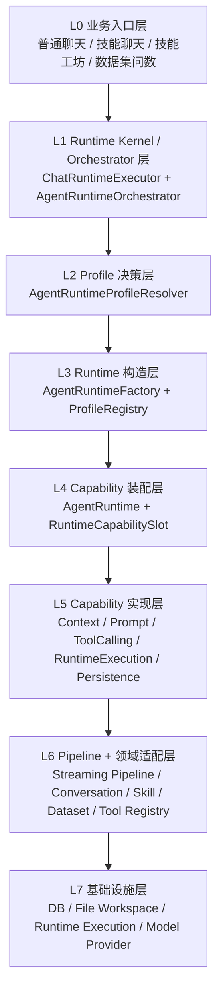
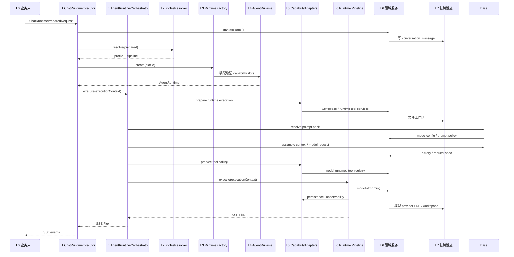

# Lingz Agent Runtime Profile/Capability 分层落地设计

**版本**: v0.2  
**日期**: 2026-05-06  
**状态**: P0 骨架已落地，能力分层已确立  
**适用范围**: 普通聊天、技能聊天、技能工坊、数据集问数、后续个人助理 Agent、SubAgent、TaskExecute

---

## 1. 这份文档解决什么问题

Lingz 现在要解决的不是“再做一个新 Agent Runtime”，而是：

> 在一套统一 Agent Runtime 内核上，把不同 Agent 形态需要的能力分层装配进去。

也就是说：

1. 普通聊天、技能聊天、技能工坊、数据集问数、个人助理 Agent 不能各自长出一套 Runtime
2. Runtime 也不能继续把上下文、提示词、工具、沙盒、持久化、观测、记忆、质检都堆进一个大类
3. 正确方向是把 Runtime 拆成稳定层级，再用后台固定 profile 选择能力组合

本文档重点描述：

1. Agent Runtime 从上到下应该分成哪些层
2. 每一层负责什么，不负责什么
3. 一次请求如何逐层向下执行
4. 当前 P0 已经落地到哪些代码
5. 哪些能力只是占位，后续再做实

---

## 2. 总体结论

### 2.1 一句话架构

> Agent Runtime = 单一 Runtime Kernel + 统一 Orchestrator + Profile 选择层 + Capability 装配层 + Pipeline 执行层 + 领域资源/基础设施层。

其中：

1. **Runtime Kernel** 只编排主链路
2. **Profile** 决定某类 Agent 应该加载哪些能力
3. **Capability** 是 Runtime 的稳定能力槽位
4. **Adapter** 把现有业务实现接到这些能力槽位上
5. **Pipeline** 负责模型调用、工具调用事件汇聚和 SSE 输出
6. **领域服务和基础设施** 继续在底层提供会话、工具、工作区、模型、数据库等能力

### 2.2 关键产品判断

当前不做动态插件，也不让用户组装 Runtime 能力。

profile 是后台固定策略：

1. 用户进入某类业务场景
2. 后端根据会话类型和运行信号解析 profile
3. profile 决定 Runtime 装载哪些 capability
4. Runtime 通过同一条主链路执行

这意味着：

> 我们要的是“几种固定 Agent Runtime Profile”，不是“一个让用户拖拽组装的 Runtime 插件系统”。

---

## 3. 上下分层总览

从上到下，Agent Runtime 分为 8 层。

分层原则：

1. 越上层越接近业务场景
2. 越下层越接近执行资源和基础设施
3. 上层只做选择和编排，不直接操作底层细节
4. 下层不反向感知上层具体业务页面
5. 新能力必须先落到某个 capability slot，再接入主链路

---

## 4. L0 业务入口层

### 4.1 这一层是什么

业务入口层是用户实际进入的场景，例如：

1. 普通聊天
2. 技能聊天
3. 已发布技能聊天
4. 技能工坊项目聊天
5. 技能工坊预览聊天
6. 数据集问数
7. 后续个人助理 Agent
8. 后续 SubAgent / TaskExecute

### 4.2 这一层产出什么

这一层最终应该收敛为统一的运行请求：

- `ChatRuntimePreparedRequest`

它携带：

1. 会话类型
2. 会话 ID
3. scope 信息
4. 用户输入
5. 附件信息
6. 运行时技能名
7. 工具 callbacks
8. prompt 和模型调用所需信息

### 4.3 这一层不应该做什么

业务入口层不应该自己决定：

1. Runtime 主链路怎么执行
2. 工具调用循环怎么跑
3. 工作区怎么准备
4. 事件怎么持久化
5. 长期记忆怎么召回
6. 质量校验怎么执行

这些都应该交给下层 Runtime。

---

## 5. L1 Runtime Kernel 层

### 5.1 核心代码

- `backend/src/main/java/lingzhou/agent/backend/business/chat/service/ChatRuntimeExecutor.java`
- `backend/src/main/java/lingzhou/agent/backend/capability/agentruntime/AgentRuntimeOrchestrator.java`
- `backend/src/main/java/lingzhou/agent/backend/capability/agentruntime/AgentRuntimeExecutionContext.java`
- `backend/src/main/java/lingzhou/agent/backend/capability/agentruntime/model/RuntimeModelRequest.java`

### 5.2 职责

Runtime Kernel 是统一运行时入口；Orchestrator 是统一执行编排入口。

当前职责是：

1. 初始化会话消息
2. 调用 profile 决策层
3. 调用 runtime 构造层
4. 构造 `AgentRuntimeExecutionContext`
5. 交给 `AgentRuntimeOrchestrator`
6. 由 Orchestrator 准备 `RuntimeModelRequest`、输出 `session_meta`、调用 pipeline

`AgentRuntimeExecutionContext` 只承载本次运行事实，例如 prepared request、用户、会话、profile resolution、runtime 装配结果。

`RuntimeModelRequest` 只承载模型调用阶段产物，例如 chat runtime bundle 和 request spec。

### 5.3 不负责

Runtime Kernel 不直接实现：

1. 上下文工程
2. 提示词工程
3. 工具调用策略
4. 沙盒边界
5. 事件持久化细节
6. 观测日志细节
7. 长期记忆
8. 产物质量校验

约束：

> `ChatRuntimeExecutor` 只允许变薄，不允许重新变厚。

---

## 6. L2 Profile 决策层

### 6.1 核心代码

- `backend/src/main/java/lingzhou/agent/backend/capability/agentruntime/AgentRuntimeProfileResolver.java`
- `backend/src/main/java/lingzhou/agent/backend/capability/agentruntime/AgentRuntimeProfile.java`
- `backend/src/main/java/lingzhou/agent/backend/capability/agentruntime/AgentRuntimePipeline.java`

### 6.2 这一层回答的问题

Profile 决策层回答两个问题：

1. 当前请求属于哪一种 Agent Runtime Profile
2. 当前请求走哪一种 Runtime Pipeline

### 6.3 当前 Profile

| Profile | 用途 | 当前状态 |
| --- | --- | --- |
| `GENERAL_CHAT` | 普通聊天 | 已接入 |
| `SKILL_CHAT` | 技能聊天、已发布技能聊天、带工具信号的技能型会话 | 已接入 |
| `SKILL_STUDIO` | 技能工坊项目聊天、预览聊天 | 已接入 |
| `DATASET_CHAT` | 数据集问数 | 已接入现有工具链路 |
| `PERSONAL_ASSISTANT` | 后续个人助理 Agent | 已预留 |
| `SUB_AGENT` | 后续 SubAgent 执行单元 | 已预留 |
| `TASK_EXECUTE` | 后续任务执行型 Agent | 已预留 |

### 6.4 当前 Pipeline

| Pipeline | 用途 |
| --- | --- |
| `GENERAL` | 普通模型流式响应，不进入工具调用循环 |
| `TOOL_AWARE` | 工具感知流式响应，可进入工具调用循环 |

### 6.5 当前解析规则

1. `DATASET_CHAT` 解析为 `DATASET_CHAT`
2. `SKILL_STUDIO_PROJECT_CHAT`、`SKILL_STUDIO_PROJECT_PREVIEW_CHAT` 解析为 `SKILL_STUDIO`
3. `SKILL_CHAT`、`PUBLISHED_SKILL_CHAT` 解析为 `SKILL_CHAT`
4. 其他会话如果带 `runtimeSkillName` 或 `toolCallbacks`，按 `SKILL_CHAT` 处理
5. 其余会话按 `GENERAL_CHAT` 处理

注意：

> profile 由后端解析，不从前端请求直接透传。

---

## 7. L3 Runtime 构造层

### 7.1 核心代码

- `backend/src/main/java/lingzhou/agent/backend/capability/agentruntime/AgentRuntimeFactory.java`
- `backend/src/main/java/lingzhou/agent/backend/capability/agentruntime/StaticAgentRuntimeProfileRegistry.java`
- `backend/src/main/java/lingzhou/agent/backend/capability/agentruntime/AgentRuntimeCapabilityRegistry.java`
- `backend/src/main/java/lingzhou/agent/backend/capability/agentruntime/AgentRuntimeProfileDefinition.java`

### 7.2 这一层回答的问题

Runtime 构造层回答：

> 给定一个 profile，本次运行应该装载哪些 capability。

流程是：

1. `AgentRuntimeProfileResolver` 给出 profile
2. `AgentRuntimeFactory` 查询 `StaticAgentRuntimeProfileRegistry`
3. registry 返回该 profile 对应的增强 capability slots
4. factory 从 `AgentRuntimeCapabilityRegistry` 找到 adapter
5. adapter contribute 到 `AgentRuntime.Builder`
6. 最终得到本次运行的增强能力集合

### 7.3 为什么叫 Static Profile Registry

因为当前产品策略是后台固定组合，不做动态插件。

因此这里不需要：

1. 数据库 profile 表
2. 用户自定义能力编排
3. 前端 profile 配置页面
4. 动态加载第三方 capability

---

## 8. L4 Capability 装配层

### 8.1 核心代码

- `backend/src/main/java/lingzhou/agent/backend/capability/agentruntime/AgentRuntime.java`
- `backend/src/main/java/lingzhou/agent/backend/capability/agentruntime/AgentRuntimeCapability.java`
- `backend/src/main/java/lingzhou/agent/backend/capability/agentruntime/RuntimeCapabilitySlot.java`
- `backend/src/main/java/lingzhou/agent/backend/capability/agentruntime/RuntimeCapabilityStatus.java`

### 8.2 这一层是什么

Capability 装配层是 Runtime 的增强能力骨架。

它不关心某个能力内部怎么做，只关心：

1. Runtime 有哪些稳定能力槽位
2. 当前 profile 装了哪些能力
3. 每个能力是 `ACTIVE` 还是 `NOOP`
4. 本次运行的能力集合是什么

它不表达 Runtime 基座。上下文工程、提示词工程、模型请求构建这类基础链路固定存在，不通过 profile 插拔。

### 8.3 当前 Capability Slots

| Slot | 含义 |
| --- | --- |
| `TOOL_CALLING` | 工具调用循环 |
| `RUNTIME_EXECUTION` | 受控运行时执行环境，组装 `runtime_tool` 并管理 sandbox/scope |
| `EVENT_PERSISTENCE` | 消息、事件、工具 trace、产物持久化 |
| `OBSERVABILITY` | 日志、统计、trace 入口 |
| `SAFETY_GUARD` | 安全监测、输入输出风险拦截 |
| `LONG_TERM_MEMORY` | 长期记忆 |
| `QUALITY_GATE` | 结果质量校验 |
| `SUB_AGENT` | SubAgent 调度 |
| `TASK_EXECUTION` | TaskExecute 计划执行 |

### 8.4 ACTIVE 与 NOOP

`ACTIVE` 表示该能力已经改变当前运行行为。

`NOOP` 表示该能力只是占位，当前不改变运行行为，但它已经固定了未来扩展位置。

这点很重要：

> P0 不是把所有能力一次做完，而是先把能力槽位和边界确定下来。

---

## 9. L5 Runtime 基座与 Capability 实现层

这一层分成两类：

1. Runtime 基座：每次模型调用都要经过，不由 profile 插拔
2. 增强 Capability：由 profile 装配，可以是 `ACTIVE` 或 `NOOP`

### 9.1 Base Context Engineering

核心代码：

- `ContextEngineeringService`
- `RuntimeContextAssembly`
- `RuntimeModelRequest`

职责：

1. 组装要交给模型的运行时上下文包
2. 将 `RuntimeContextAssembly` 落到模型请求规格
3. 产出 `RuntimeModelRequest`
4. 当前上下文包包含历史消息、系统提示词、用户消息、工具回调
5. 提供上下文压缩入口
6. 后续承接附件上下文、摘要上下文、技能上下文、记忆上下文

这是 Runtime 基座，不属于 capability slot。

### 9.2 Base Prompt Engineering

核心代码：

- `PromptEngineeringService`
- `RuntimePromptPack`
- `RuntimePromptBlock`
- `RuntimePromptSourceType`

职责：

1. 统一管理系统提示词来源
2. 按 profile/pipeline/model/prepared request 产出 `RuntimePromptPack`
3. 将模型默认提示词、通用聊天提示词、工具感知提示词、场景提示词、宿主追加提示词集中排序
4. 后续承接不同 profile 的 prompt pack
5. 将技能说明、运行约束、输出规范分层管理

这是 Runtime 基座，不属于 capability slot。

提示词来源规范：

| Source Type | 默认顺序 | 典型来源 | 放置原则 |
| --- | --- | --- | --- |
| `MODEL` | 100 | 模型配置里的默认 system prompt | 模型供应商或模型运行参数事实 |
| `CONFIG` | 200 | `app.chat.general-system-prompt`、`app.chat.system-prompt` | 可运营、可调优的基础提示词 |
| `SCENE` | 300 | skill、dataset、skillstudio 场景提示词 | 场景业务规则，逐步从 request assembler 迁入 prompt 工程 |
| `PROTOCOL` | 400 | `runtime_tool`、artifact schema、工具调用协议 | 与代码协议强绑定的固定约束 |
| `CAPABILITY` | 500 | memory、safety、quality、sub-agent 能力贡献 | 增强能力只贡献 prompt block，不直接拼 system prompt |
| `REQUEST` | 900 | 宿主传入的 `systemPromptAppend` | 单次请求追加约束，最后叠加 |

硬性边界：

1. `Orchestrator`、`Pipeline`、`ModelRuntimeClientFactory` 不拼提示词
2. 工具对象和 callback 归 Tool Calling / Runtime Execution；工具使用说明归 Prompt Engineering
3. 任何给模型看的规则性文字都必须进入 `RuntimePromptPack`
4. `ChatRuntimePreparedRequest.systemPrompt` 表示场景提示词，`systemPromptAppend` 表示单次请求追加提示词，不能提前 merge

### 9.3 Tool Calling

核心代码：

- `ToolCallingCapabilityAdapter`

职责：

1. 创建技能工具调用 bundle
2. 承接现有 `SkillAwareToolCallingManager`
3. 后续承接工具选择、工具调用轮次、工具失败恢复策略

当前状态：`ACTIVE`

### 9.4 Runtime Execution

核心代码：

- `RuntimeExecutionCapabilityAdapter`
- `RuntimeToolExecutionService`
- `SandboxExecutionService`

职责：

1. 准备受控工作区
2. 根据 execution scope 组装 `runtime_tool`
3. 绑定工具调用时的 runtime context
4. 激活/清理技能执行 scope
5. 解析 filesystem skill 和 skillstudio draft root
6. 后续承接 native/docker/remote backend 的统一边界

当前状态：`ACTIVE`

边界说明：

> `runtime_tool` 不是独立 capability，而是 `RuntimeExecution` 根据当前 sandbox/scope 提供给模型的工具协议。

### 9.5 Event Persistence

核心代码：

- `EventPersistenceCapabilityAdapter`

职责：

1. 完成普通回复持久化
2. 完成技能回复持久化
3. 处理中断、失败、工具事件
4. 持久化工具 trace
5. 提取最终 artifact
6. 合并 params JSON

当前状态：`ACTIVE`

### 9.6 Observability

核心代码：

- `ObservabilityCapabilityAdapter`

职责：

1. 记录 runtime 装配结果
2. 记录上下文统计
3. 记录 `RuntimePromptPack` debugger 日志
4. 记录 `RuntimeContextAssembly` debugger 日志
5. 记录模型 round 吞吐
6. 记录 streaming 错误
7. 后续承接 trace id、span、回放定位

Debugger 日志说明：

1. 只在 `debug` 级别输出
2. 包含 prompt block、最终 system prompt、history message、user message、tool callback 名称
3. 对长文本做截断，避免附件内容或历史上下文打爆日志

当前状态：`ACTIVE`

### 9.7 Pipeline

核心代码：

- `AgentRuntimeStreamingPipeline`

职责：

1. 根据 `AgentRuntimeExecutionContext` 选择普通流式或工具感知流式
2. 调用模型
3. 聚合 assistant delta
4. 汇聚工具事件
5. 组织 `done` / `error` SSE
6. 只消费 `RuntimeModelRequest` 中的模型请求，不重新组装上下文或提示词

说明：

> Streaming 是 runtime 执行方式，不再作为 profile capability 装配。

### 9.8 Future Capabilities

以下能力当前是 `NOOP`：

| Capability | Adapter | 后续方向 |
| --- | --- | --- |
| Safety Guard | `SafetyGuardCapabilityAdapter` | 输入风险检测、输出安全监测、敏感动作拦截 |
| Long Term Memory | `LongTermMemoryCapabilityAdapter` | 记忆写入、召回、治理 |
| Quality Gate | `QualityGateCapabilityAdapter` | 产物存在性、格式、结构合法性、业务规则校验 |
| SubAgent | `SubAgentCapabilityAdapter` | 子 Agent 调度、父子上下文隔离 |
| Task Execution | `TaskExecutionCapabilityAdapter` | 任务计划、步骤执行、重试、状态机 |

---

## 10. L6 领域适配层

### 10.1 这一层是什么

领域适配层不是 Agent Runtime 的策略层，而是 Runtime capability 会调用的既有业务服务。

典型对象包括：

1. `ConversationHistoryService`
2. Skill catalog / skill runtime 相关服务
3. Dataset tool 相关服务
4. Runtime workspace resolver
5. Runtime execution facade
6. Tool registry / tool callback provider
7. Artifact service

### 10.2 边界

领域适配层负责提供具体业务能力，但不应该反过来决定 Runtime profile。

例如：

1. 技能服务可以提供 skill tools
2. 工作区服务可以准备目录
3. 事件服务可以写入会话事件
4. 但它们不应该自己分叉出另一套 Agent Runtime 主链路

---

## 11. L7 基础设施层

基础设施层承载真正的外部资源：

1. 数据库
2. 文件工作区
3. runtime python 环境
4. native/docker/remote 执行 backend
5. 模型 provider
6. 对象存储或 artifact 存储
7. 后续 trace/metrics 系统

Runtime 上层不直接依赖这些细节，而是通过 L5 capability 和 L6 领域服务间接使用。

---

## 12. 一次请求如何逐层执行

以下是当前 P0 的实际调用链。

展开成步骤：

1. 业务入口把场景请求统一准备成 `ChatRuntimePreparedRequest`
2. `ChatRuntimeExecutor` 创建会话消息上下文
3. `AgentRuntimeProfileResolver` 根据会话类型和运行信号选择 profile/pipeline
4. `AgentRuntimeFactory` 根据 profile 查出增强 capability slots
5. `AgentRuntimeCapabilityRegistry` 找到具体 adapter
6. `AgentRuntime` 表示本次运行装配了哪些增强能力
7. `ChatRuntimeExecutor` 构造 `AgentRuntimeExecutionContext`
8. `AgentRuntimeOrchestrator` 调用 `RuntimeExecutionCapabilityAdapter` 准备工作区并绑定 `runtime_tool`
9. `AgentRuntimeOrchestrator` 根据 pipeline 调用模型 bundle 构造逻辑，工具感知链路会调用 `ToolCallingCapabilityAdapter`
10. `AgentRuntimeOrchestrator` 调用 `PromptEngineeringService` 产出 `RuntimePromptPack`
11. `AgentRuntimeOrchestrator` 调用 `ContextEngineeringService` 组装 `RuntimeContextAssembly` 并产出 `RuntimeModelRequest`
12. `AgentRuntimeOrchestrator` 将 runtime tool context 和 skill execution scope 包到执行流外层
13. `AgentRuntimeStreamingPipeline` 消费 `AgentRuntimeExecutionContext` 和 `RuntimeModelRequest` 执行普通流式或工具感知流式
14. 过程事件和最终消息由 `EventPersistenceCapabilityAdapter` 写入
15. 日志和统计由 `ObservabilityCapabilityAdapter` 记录
16. SSE 返回给上层业务入口

### 12.1 Profile 如何影响编排

`AgentRuntimeOrchestrator` 不只根据 `AgentRuntimePipeline` 分流，也会读取 `AgentRuntime` 中的 active capability 来决定增强阶段是否执行。

Runtime 基座固定执行：

| 阶段 | 触发条件 | 行为 |
| --- | --- | --- |
| Base Prompt Engineering | 固定执行 | 产出 `RuntimePromptPack` |
| Base Context Engineering | 固定执行 | 组装 `RuntimeContextAssembly`，产出 `RuntimeModelRequest` |

当前增强能力编排规则是：

| 阶段 | 触发条件 | 行为 |
| --- | --- | --- |
| Runtime 装配观测 | `OBSERVABILITY` active | 输出 runtime profile/capability 装配日志 |
| Runtime Execution 准备 | `RUNTIME_EXECUTION` active | 准备工作区，绑定 `runtime_tool` callback |
| Tool Calling bundle | `TOOL_CALLING` active 且 pipeline 为 `TOOL_AWARE` | 创建工具感知模型 bundle |
| Skill execution scope | `RUNTIME_EXECUTION` active 且 pipeline 为 `TOOL_AWARE` | 在流执行外层激活/清理 skill scope |
| Runtime tool context | `RUNTIME_EXECUTION` active | 在流执行外层绑定 runtime tool context |

这意味着：

> profile 不负责装配 Runtime 基座；profile 只声明增强能力组合，并决定本次 runtime 的增强阶段如何编排。

---

## 13. Profile 增强能力矩阵

Runtime 基座对所有 profile 固定存在：

| Base Runtime Layer | GENERAL_CHAT | SKILL_CHAT | SKILL_STUDIO | DATASET_CHAT | PERSONAL_ASSISTANT | SUB_AGENT | TASK_EXECUTE |
| --- | --- | --- | --- | --- | --- | --- | --- |
| Context Engineering | Y | Y | Y | Y | Y | Y | Y |
| Prompt Engineering | Y | Y | Y | Y | Y | Y | Y |

Profile 只声明增强能力组合：

| Capability | GENERAL_CHAT | SKILL_CHAT | SKILL_STUDIO | DATASET_CHAT | PERSONAL_ASSISTANT | SUB_AGENT | TASK_EXECUTE |
| --- | --- | --- | --- | --- | --- | --- | --- |
| Tool Calling | - | Y | Y | Y | Y | Y | Y |
| Runtime Execution | - | Y | Y | - | - | - | - |
| Event Persistence | Y | Y | Y | Y | Y | Y | Y |
| Observability | Y | Y | Y | Y | Y | Y | Y |
| Safety Guard | NOOP | NOOP | NOOP | NOOP | NOOP | NOOP | NOOP |
| Long Term Memory | NOOP | NOOP | NOOP | NOOP | NOOP | NOOP | NOOP |
| Quality Gate | NOOP | NOOP | NOOP | NOOP | NOOP | NOOP | NOOP |
| SubAgent | - | - | - | - | - | NOOP | NOOP |
| Task Execution | - | - | - | - | NOOP | - | NOOP |

说明：

1. Base Runtime Layer 的 `Y` 表示所有 profile 固定经过该基座阶段
2. Capability 表的 `Y` 表示 profile 装载该增强能力，且当前能力为 `ACTIVE`
3. `NOOP` 表示 profile 装载占位 adapter，但当前不改变行为
4. `-` 表示该 profile 当前不装载该增强能力
5. `DATASET_CHAT` 当前保持现有工具感知链路，不默认装载 `Runtime Execution`

---

## 14. 数据库策略

P0 不需要新增数据库表，也不需要修改现有表。

原因：

1. 本轮是后端架构解耦，不引入新的业务事实
2. 现有会话事实仍复用 `conversation_session`、`conversation_message`、`conversation_event`
3. 现有工具执行和产物摘要仍沿用当前消息、事件、params JSON 结构
4. 安全监测、长期记忆、质量校验、SubAgent、TaskExecution 目前只是 adapter 占位，不落独立事实表

后续只有当以下能力从 `NOOP` 转为真实闭环时，才考虑新增表：

| 能力 | 未来可能需要的持久化 |
| --- | --- |
| Safety Guard | 风险事件、拦截记录、人工确认、审计日志 |
| Long Term Memory | 记忆条目、记忆来源、记忆版本、召回记录 |
| Quality Gate | 校验规则、校验结果、修复建议、人工确认 |
| SubAgent | 子任务、子 Agent 输入输出、父子消息关系 |
| TaskExecution | 任务计划、步骤状态、重试记录、执行快照 |
| Observability | 独立 trace/span 表或外部可观测系统 |

---

## 15. 扩展规范

### 15.1 新增 Profile

新增 profile 时按以下步骤处理：

1. 在 `AgentRuntimeProfile` 增加枚举
2. 在 `StaticAgentRuntimeProfileRegistry` 注册能力组合
3. 在 `AgentRuntimeProfileResolver` 增加解析规则
4. 明确该 profile 使用 `GENERAL` 还是 `TOOL_AWARE` pipeline
5. 补充本文档的 profile 矩阵

### 15.2 新增 Capability

新增 capability 时按以下步骤处理：

1. 在 `RuntimeCapabilitySlot` 增加 slot
2. 新增 `*CapabilityAdapter`
3. 让 adapter 实现 `AgentRuntimeCapability`
4. 在 adapter 中声明 `ACTIVE` 或 `NOOP`
5. 按需加入对应 profile
6. 将原本散落在 `ChatRuntimeExecutor` 或其他 service 的逻辑迁入 adapter

### 15.3 NOOP 转 ACTIVE

当一个 `NOOP` adapter 转为 `ACTIVE` 时，必须同时明确：

1. 输入来自哪里
2. 输出写到哪里
3. 是否影响 SSE 事件
4. 是否需要数据库表
5. 是否需要前端展示
6. 是否会改变 profile 矩阵
7. 是否需要失败降级策略

---

## 16. P0 明确不做

本轮不做以下内容：

1. 动态插件系统
2. 用户自定义 Runtime 能力编排
3. 多套 Runtime Kernel
4. 长期记忆真实召回和写入
5. 质量校验真实规则引擎
6. SubAgent 调度器
7. TaskExecute 计划执行器
8. 新增数据库表
9. 开放 `bash` 给模型
10. 把 `runtime_tool` 扩展成通用 shell

---

## 17. 下一阶段建议

P1 建议按这个顺序推进：

1. 做实上下文工程层
   - 以 `RuntimeContextAssembly` 为统一入口，纳入历史消息、摘要、附件、技能上下文、数据集上下文，并统一落到 `RuntimeModelRequest`
2. 做实提示词工程层
   - 按 profile 拆 `RuntimePromptPack`，明确系统约束、工具说明、输出规范的位置
3. 做强观测层
   - 引入 runtime trace id，贯穿 profile、模型 round、tool call、artifact
4. 做第一版质量校验层
   - 先从产物存在性、文件格式、结构化 artifact 合法性开始
5. 再做长期记忆
   - 避免在上下文工程未稳定前提前设计记忆表

---

## 18. 维护原则

后续改 Runtime 时遵守以下原则：

1. 新场景优先新增 profile，不新增 Runtime Kernel
2. 新能力优先新增 capability slot，不直接塞进 `ChatRuntimeExecutor`
3. profile 组合由后台维护，不从用户请求动态拼装
4. 数据库改动必须由真实业务事实驱动，不能因为 adapter 存在就提前建表
5. `runtime_tool` 继续保持小白名单
6. `runtime_tool` 只能由 `RuntimeExecution` 基于当前 execution scope 组装
7. 领域服务提供资源，不反向决定 Runtime 主链路

最终目标：

> Runtime 主链路稳定，能力逐层增强，场景通过 profile 分化，而不是通过多套 Runtime 分叉。
