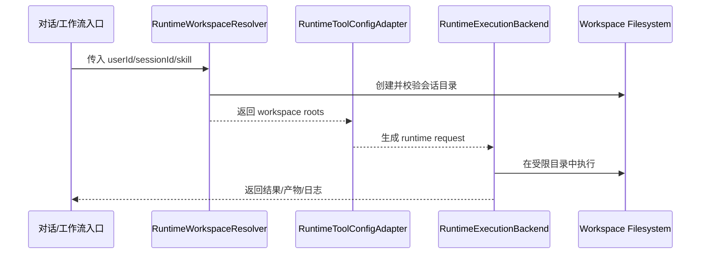

# 基于 Lingclaw 的 Runtime 沙盒架构设计

**版本**: v1.0  
**日期**: 2026-04-22  
**状态**: 方案设计  
**适用范围**: 当前项目 runtime 执行链路，支持 `native` / `docker` 两种运行模式切换

---

## 1. 设计目标

本方案的目标不是重新发明一套沙盒，而是：

1. 技术实现尽量复用 `lingclaw` 已验证的沙盒机制
2. 运行时目录与权限模型严格落到本项目的 [workspace-design.md](../workspace-design.md)
3. 通过配置文件切换 `native` / `docker` 两种 runtime 执行方式
4. 让 skill 运行时与 skill 工坊、正式 skill 定义、用户长期资料彻底分层
5. 为后续升级到更强隔离或调度层保留兼容接口

---

## 2. 总体结论

建议采用：

1. **工作区模型沿用当前项目设计**
   - `/workspaces/public/...`
   - `/workspaces/users/<userId>/sessions/<sessionId>/...`
2. **沙盒技术实现沿用 lingclaw**
   - 统一 `coding_tool`
   - 统一 `sandboxMode`
   - 统一 `sandboxRoot`
   - `native` 使用 `PathJail`
   - `docker` 使用容器挂载 + `docker exec`
3. **沙盒粒度从“Agent 静态目录”升级为“运行时动态 workspace”**
   - 不是后台给 Agent 永久配置一个固定目录
   - 而是 runtime 在每次会话执行前动态组装一组 `sandboxRoot`

一句话定义：

> **工作区语义由本项目定义，沙盒执行内核采用 lingclaw。**

---

## 3. 设计边界

### 3.1 本方案覆盖

1. runtime 工作区分配
2. `native` / `docker` 两种运行模式
3. 统一的 `sandboxRoot` 挂载描述
4. skill 运行时可读写边界
5. 配置文件驱动的模式切换

### 3.2 本方案不覆盖

1. skill 工坊编辑链路详细实现
2. K8s 编排
3. 多语言 runtime
4. 远程 Electron `remote` 模式

`remote` 不是本轮重点，但架构上保留扩展位，避免后续冲突。

---

## 4. 运行时分层

结合 [workspace-design.md](../workspace-design.md)，runtime 实际分为 4 类目录：

### 4.1 正式 skill 定义层

路径：

- `/workspaces/public/skills/<skill-name>/`

职责：

1. 存正式发布的 `SKILL.md`
2. 存 `references/`
3. 存 `scripts/`
4. 存 `requirements.txt`
5. 存运行元信息 `meta/`

约束：

1. runtime 默认只读
2. skill 执行过程中禁止修改 skill 自身定义

### 4.2 用户长期资料层

路径：

- `/workspaces/users/<userId>/profile/`

职责：

1. 用户偏好
2. 助理风格
3. 长期记忆

约束：

1. 默认可读
2. 是否允许写入由策略控制
3. 建议默认只允许结构化写入指定文件，如 `memory.md`

### 4.3 用户会话工作区层

路径：

- `/workspaces/users/<userId>/sessions/<sessionId>/`

职责：

1. 承接当前运行的全部文件活动
2. 保存上传文件、临时文件、产物、日志、元数据

约束：

1. 是 runtime 的主活动空间
2. 是 `native` / `docker` 的主要可写区域

### 4.4 公共工坊层

路径：

- `/workspaces/public/skillstudio/`

职责：

1. 支撑 skill 创建编辑
2. 支撑模板、草稿、工坊记忆

约束：

1. skill 运行时默认不暴露写权限
2. 绝大多数 runtime 场景下不应挂载该目录

---

## 5. Runtime 抽象模型

参考 lingclaw 的 `ToolConfig.sandbox + sandboxRoot`，本项目定义统一运行时配置：

```json
{
  "runtime": {
    "mode": "native",
    "defaultWorkDir": "workspace",
    "commandTimeoutSeconds": 120,
    "sandboxRoots": [
      {
        "key": "session-workspace",
        "path": "/workspaces/users/1001/sessions/s_abc/workspace",
        "read": true,
        "write": true
      },
      {
        "key": "session-uploads",
        "path": "/workspaces/users/1001/sessions/s_abc/uploads",
        "read": true,
        "write": false
      },
      {
        "key": "session-outputs",
        "path": "/workspaces/users/1001/sessions/s_abc/outputs",
        "read": true,
        "write": true
      },
      {
        "key": "skill-definition",
        "path": "/workspaces/public/skills/report-skill",
        "read": true,
        "write": false
      }
    ]
  }
}
```

其中：

1. `mode` 是运行模式切换开关
2. `sandboxRoots` 是运行时动态装配结果
3. `sandboxRoots[0]` 作为默认主工作目录根
4. `defaultWorkDir` 是逻辑目录名，最终会被解析到某个绝对路径

---

## 6. 配置文件切换模型

建议把“模式切换”和“路径生成”分开：

### 6.1 静态配置负责

1. 当前环境默认使用 `native` 还是 `docker`
2. `docker` 模式下的镜像、网络、资源限制
3. 是否允许 profile 写入
4. 是否允许挂载公共模板区

### 6.2 运行时装配负责

1. 根据 `userId + sessionId + skillId` 生成本次 `sandboxRoots`
2. 根据 skill 类型决定是否需要额外挂载模板区、profile 区
3. 根据运行模式把同一套 roots 映射给 `native` 或 `docker`

建议配置文件示意：

```yaml
runtime:
  mode: native
  workspacesBaseDir: /workspaces
  allowProfileWrite: false
  allowTemplateRead: true
  commandTimeoutSeconds: 120
  docker:
    imageName: lingzhou/runtime-sandbox:latest
    networkMode: none
    memoryLimit: 1g
    cpuLimit: "1"
    pidsLimit: 128
```

切换方式：

1. 开发机默认 `native`
2. 生产或高风险任务切到 `docker`
3. 切换时不改变业务侧工具协议，只改变 runtime backend

---

## 7. 核心组件设计

建议新增以下抽象：

### 7.1 `RuntimeWorkspaceResolver`

职责：

1. 根据 `userId + sessionId + skillName` 计算路径
2. 确保目录存在
3. 生成本次运行需要的 `sandboxRoots`

输出：

1. `workspace/`
2. `uploads/`
3. `outputs/`
4. `temp/`
5. `logs/`
6. `meta/`
7. `profile/`
8. `skill-definition/`

### 7.2 `RuntimeSandboxConfig`

职责：

1. 承载静态配置
2. 对应配置文件中的 `runtime.mode`、`docker.*`

### 7.3 `RuntimeExecutionBackend`

职责：

1. 抽象统一执行接口
2. 屏蔽 `native` / `docker` 的差异

接口建议：

```java
public interface RuntimeExecutionBackend {
    String getMode();
    ExecutionResult execute(RuntimeExecutionRequest request);
}
```

### 7.4 `NativeRuntimeBackend`

职责：

1. 复用 lingclaw `PathJail`
2. 在宿主机本地进程内执行命令
3. 注入环境变量隔离

### 7.5 `DockerRuntimeBackend`

职责：

1. 复用 lingclaw `DockerSandbox`
2. 将同一套 `sandboxRoots` 转成容器挂载
3. 用 `docker exec` 执行

### 7.6 `RuntimeToolConfigAdapter`

职责：

1. 把本项目 runtime workspace 配置适配成 lingclaw 风格的 `sandboxRoot`
2. 避免业务层直接依赖 lingclaw 内部结构

---

## 8. 与 Lingclaw 的映射关系

### 8.1 直接复用的思想

1. `sandboxMode` 统一路由
2. `coding_tool` 统一动作面
3. 多根 `sandboxRoot`
4. `PathJail` 多目录读写权限校验
5. `DockerSandbox` 懒创建容器 + `docker exec`

### 8.2 需要调整的地方

lingclaw 当前更偏：

1. Agent 级静态 `sandboxRoot`
2. `sandboxRoot[0]` 代表 Agent 主目录
3. Docker 容器以 `agentId` 命名和复用

本项目应改为：

1. runtime 级动态 `sandboxRoot`
2. `sandboxRoot[0]` 代表当前 session 的主工作区
3. 容器粒度优先与 `sessionId` 或 `runId` 绑定，而不是 `agentId`

建议容器命名：

- `runtime_<sessionId>`
- 或 `runtime_<runId>`

不建议继续沿用 `sandbox_<agentId>`。

---

## 9. 权限基线

建议固定以下默认权限：

| 区域 | 读 | 写 | 说明 |
|------|----|----|------|
| `workspace/` | 是 | 是 | 主工作目录 |
| `temp/` | 是 | 是 | 临时文件 |
| `outputs/` | 是 | 是 | 最终产物 |
| `logs/` | 是 | 是 | 执行日志 |
| `uploads/` | 是 | 否 | 用户上传原件默认只读 |
| `profile/` | 是 | 否 | 默认只读，后续可灰度开放 |
| `public/skills/<skill>/` | 是 | 否 | skill 定义只读 |
| `public/skillstudio/` | 否 | 否 | runtime 默认不挂载 |

---

## 10. 执行时序



---

## 11. 推荐实施顺序

1. 先固化 `RuntimeWorkspaceResolver`
2. 再定义统一 `RuntimeExecutionBackend`
3. 第一阶段接 `native`
4. 第二阶段接 `docker`
5. 运行链路稳定后，再把更多工具收口到统一 runtime backend

---

## 12. 最终建议

本项目不建议“自己重新做一套沙盒细节”，而建议采用：

1. **目录模型遵循本项目 `workspace-design.md`**
2. **执行内核复用 lingclaw 的 `PathJail` 与 `DockerSandbox` 思路**
3. **模式切换通过配置文件完成**
4. **所有运行时权限都通过动态生成的 `sandboxRoots` 表达**

这样做的好处是：

1. 你保留了自己更清晰的 workspace 语义
2. 又避免重复踩一遍沙盒实现的坑
3. `native` 和 `docker` 可以共用一套上层运行时协议
4. 后续扩展 `remote` 或更强容器隔离时也不会推翻整体架构
