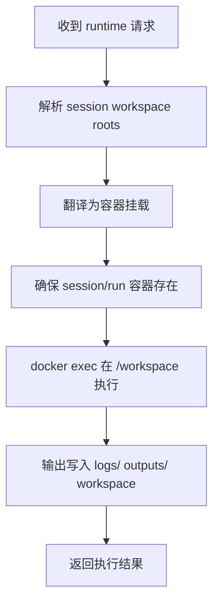

# 基于 Lingclaw 的 Docker Runtime 设计

**版本**: v1.0  
**日期**: 2026-04-22  
**状态**: 方案设计  
**适用范围**: 本项目 `runtime.mode=docker` 时的容器化执行

---

## 1. 目标

`docker` 模式用于：

1. 生产环境
2. 高风险命令执行场景
3. 需要更强进程级、文件系统级边界的环境
4. 希望统一依赖环境和资源限制的部署

本模式沿用 lingclaw 的基本思路：

1. 每个运行实例使用独立容器
2. 通过多挂载目录暴露最小必要文件
3. 所有命令在容器内执行
4. 用资源与网络配置限制容器能力

但粒度要从 `agentId` 级容器调整为：

> **session 级或 run 级容器**

---

## 2. 总体原则

### 2.1 目录语义不变

`docker` 模式不是重新定义一套目录，而是把同一套 workspace 目录映射进容器：

1. `workspace/`
2. `uploads/`
3. `outputs/`
4. `temp/`
5. `logs/`
6. `profile/`
7. `skill-definition/`

### 2.2 上层协议不变

对业务侧和工具侧来说：

1. 仍然是同一套 runtime request
2. 仍然是同一套 `sandboxRoots`
3. 只是 backend 从 `native` 切到 `docker`

### 2.3 容器是执行 backend，不是工作区来源

工作区始终在宿主机文件系统中定义和分配，Docker 只是挂载和执行者。

---

## 3. 宿主目录到容器目录的映射

建议固定容器内目录布局，避免模型看到杂乱路径。

### 3.1 推荐映射

| key | 宿主路径 | 容器路径 | 权限 |
|-----|----------|----------|------|
| `session-workspace` | `.../sessions/<sessionId>/workspace` | `/workspace` | 读写 |
| `session-uploads` | `.../sessions/<sessionId>/uploads` | `/uploads` | 只读 |
| `session-outputs` | `.../sessions/<sessionId>/outputs` | `/outputs` | 读写 |
| `session-temp` | `.../sessions/<sessionId>/temp` | `/temp` | 读写 |
| `session-logs` | `.../sessions/<sessionId>/logs` | `/logs` | 读写 |
| `user-profile` | `.../users/<userId>/profile` | `/profile` | 默认只读 |
| `skill-definition` | `.../public/skills/<skill>` | `/skill` | 只读 |

### 3.2 默认工作目录

建议固定：

- 容器内默认工作目录：`/workspace`

这样模型只需要理解：

1. 默认在 `/workspace`
2. 上传文件在 `/uploads`
3. 最终产物在 `/outputs`
4. skill 定义在 `/skill`

这比直接暴露宿主机长路径更稳定。

---

## 4. 建议复用的 Lingclaw 能力

### 4.1 `DockerSandbox`

建议直接吸收它的几项核心经验：

1. 懒创建容器
2. `docker exec` 复用执行
3. 容器资源限制
4. 网络模式限制
5. 镜像不存在时给出清晰错误

### 4.2 `sandboxRoot -> mount` 转换

沿用 lingclaw 的思想，但把挂载来源改成 runtime 动态组装结果。

也就是：

1. 业务层不直接写容器挂载
2. 业务层只描述 workspace roots
3. Docker backend 再把 roots 翻译成 `-v host:container[:ro]`

### 4.3 容器内 workDir 翻译

类似 lingclaw 的 `translateToContainerPath`，但本项目更建议直接固定容器内路径别名：

1. `workspace -> /workspace`
2. `uploads -> /uploads`
3. `outputs -> /outputs`
4. `temp -> /temp`
5. `logs -> /logs`
6. `skill-definition -> /skill`

避免把复杂宿主路径映射逻辑暴露给上层。

---

## 5. 容器粒度设计

### 5.1 不建议继续使用 Agent 级容器

原因：

1. 不符合你的会话工作区隔离模型
2. 多会话容易共享状态
3. 日志和故障定位会变模糊
4. 容器内缓存和临时文件容易污染下一次执行

### 5.2 推荐两种粒度

#### 方案 A：Session 级容器

特点：

1. 同一会话内多次执行可复用容器
2. 启动成本更低
3. 适合一个会话有连续交互和持续文件操作

容器名示例：

- `runtime_session_<sessionId>`

#### 方案 B：Run 级容器

特点：

1. 每次运行完全独立
2. 隔离最强
3. 产物和日志归因最清楚
4. 冷启动更多

容器名示例：

- `runtime_run_<runId>`

### 5.3 当前建议

优先采用：

1. **Session 级 workspace**
2. **Session 级容器，可配置空闲回收**

这是在隔离、实现复杂度、性能之间比较均衡的选择。

---

## 6. 配置文件设计

建议：

```yaml
runtime:
  mode: docker
  workspacesBaseDir: /workspaces
  commandTimeoutSeconds: 120
  docker:
    imageName: lingzhou/runtime-sandbox:latest
    networkMode: none
    memoryLimit: 1g
    cpuLimit: "1"
    pidsLimit: 128
    reuseScope: session
    idleTtlSeconds: 1800
    autoCreateImage: false
```

字段含义：

1. `reuseScope`
   - `session`: 一个 session 复用一个容器
   - `run`: 一次执行一个容器
2. `idleTtlSeconds`
   - 空闲多久回收 session 容器
3. `networkMode`
   - `none`: 默认最安全
   - `bridge`: 明确需要联网时再开启

---

## 7. 资源与安全策略

### 7.1 资源限制

建议至少保留：

1. 内存限制
2. CPU 限制
3. PID 限制
4. 命令超时

### 7.2 网络限制

默认建议：

1. `networkMode=none`

只有以下情况才考虑放开：

1. skill 明确需要访问外部 API
2. 任务需要下载公开资源
3. 已有更上层的出网策略控制

### 7.3 文件权限限制

容器挂载必须严格按 root 权限映射：

1. `uploads` 只读
2. `skill-definition` 只读
3. `profile` 默认只读
4. `workspace`、`outputs`、`temp`、`logs` 读写

---

## 8. Docker Backend 组件设计

### 8.1 `DockerRuntimeBackend`

职责：

1. 接收统一 `RuntimeExecutionRequest`
2. 把 roots 转成容器挂载
3. 确保容器已创建
4. 在容器内执行命令
5. 管理容器生命周期

### 8.2 `DockerMountTranslator`

职责：

1. 把 runtime roots 翻译成容器挂载配置
2. 统一容器内固定路径
3. 负责 `read/write -> ro/rw`

### 8.3 `DockerContainerRegistry`

职责：

1. 根据 `sessionId` 或 `runId` 维护容器映射
2. 判断容器是否已存在
3. 执行空闲回收

### 8.4 `DockerExecutionContext`

建议包含：

1. `containerName`
2. `imageName`
3. `workDir=/workspace`
4. `commandTimeoutSeconds`
5. `networkMode`
6. `mounts`

---

## 9. 执行流程



---

## 10. 日志与产物落位

建议：

1. 标准输出和标准错误的采样结果返回给调用方
2. 更完整日志落到 `sessions/<sessionId>/logs/`
3. 最终交付文件统一落到 `outputs/`
4. 中间文件落到 `workspace/` 或 `temp/`

这样做的好处：

1. 容器删掉后，日志和产物仍保留在宿主工作区
2. 与 `native` 模式下的文件组织完全一致
3. 运行 backend 不会改变上层文件语义

---

## 11. 与 Native 模式的关系

两种模式的共同点：

1. 同一套 workspace 目录
2. 同一套 root 权限模型
3. 同一套 runtime request
4. 同一套输出与产物落位

差异只在执行后端：

1. `native` 在宿主进程执行，依赖 `PathJail`
2. `docker` 在容器内执行，依赖 mount + 资源限制

所以业务层不应该感知太多模式差异。

---

## 12. 推荐结论

`docker` 模式建议作为本项目的生产态 runtime：

1. 工作区模型完全沿用 [workspace-design.md](../workspace-design.md)
2. 技术实现复用 lingclaw `DockerSandbox` 的核心思路
3. 容器粒度从 `agentId` 升级为 `sessionId` 或 `runId`
4. 容器内路径固定为 `/workspace`、`/uploads`、`/outputs`、`/temp`、`/logs`、`/profile`、`/skill`
5. 默认断网，按需放开

这样可以把“你的工作区设计”与“lingclaw 的 Docker 沙盒能力”自然拼到一起，而不是两套体系互相打架。
