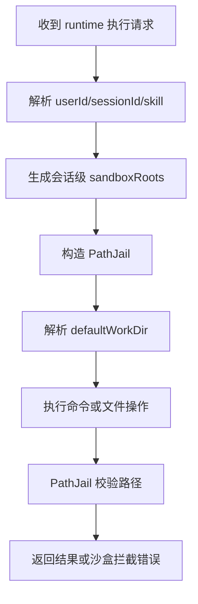

# 基于 Lingclaw 的 Native Runtime 设计

**版本**: v1.0  
**日期**: 2026-04-22  
**状态**: 方案设计  
**适用范围**: 本项目 `runtime.mode=native` 时的本地工作区隔离执行

---

## 1. 目标

`native` 模式用于：

1. 本地开发环境
2. 无 Docker 环境的部署
3. 轻量级执行场景
4. 调试成本优先、隔离要求中等的环境

本模式不追求内核级隔离，而是追求：

1. 明确目录边界
2. 可控读写权限
3. 低成本接入
4. 与 `docker` 共享同一套 workspace 语义

---

## 2. 总体原则

`native` 模式完全沿用 lingclaw 的核心思路：

1. 用多根 `sandboxRoot` 表达允许访问的目录集合
2. 用 `PathJail` 做路径解析和越界拦截
3. 用挂载项上的 `read/write` 做权限控制
4. 用环境变量重写降低子进程感知宿主环境的能力

但目录来源不再是“后台静态配置 Agent 目录”，而是：

> 由 runtime 在每次 session 执行前，基于 `workspace-design.md` 动态计算

---

## 3. Native 工作区映射

以某次运行时为例：

- `userId=1001`
- `sessionId=s_abc`
- `skill=report-skill`

运行时装配出的 roots 示例：

```json
[
  {
    "key": "session-workspace",
    "hostPath": "/workspaces/users/1001/sessions/s_abc/workspace",
    "read": true,
    "write": true
  },
  {
    "key": "session-uploads",
    "hostPath": "/workspaces/users/1001/sessions/s_abc/uploads",
    "read": true,
    "write": false
  },
  {
    "key": "session-outputs",
    "hostPath": "/workspaces/users/1001/sessions/s_abc/outputs",
    "read": true,
    "write": true
  },
  {
    "key": "session-temp",
    "hostPath": "/workspaces/users/1001/sessions/s_abc/temp",
    "read": true,
    "write": true
  },
  {
    "key": "session-logs",
    "hostPath": "/workspaces/users/1001/sessions/s_abc/logs",
    "read": true,
    "write": true
  },
  {
    "key": "user-profile",
    "hostPath": "/workspaces/users/1001/profile",
    "read": true,
    "write": false
  },
  {
    "key": "skill-definition",
    "hostPath": "/workspaces/public/skills/report-skill",
    "read": true,
    "write": false
  }
]
```

其中第一项必须为主工作目录：

- `sandboxRoots[0] = session-workspace`

因为 lingclaw 的 `PathJail`、默认 workDir、环境变量隔离都天然围绕第一根展开。

---

## 4. 建议复用的 Lingclaw 能力

### 4.1 `PathJail`

用途：

1. 解析相对路径
2. 限制文件读写只能发生在允许目录中
3. 对符号链接和 `..` 做越界防护

建议直接保留它的设计原则：

1. 多根目录
2. `toRealPath()` 防软链逃逸
3. 文件不存在时 `normalize()` 兜底
4. `sandboxRoot[0]` 作为默认基准目录

### 4.2 Shell 命令安全检查

建议沿用 lingclaw 的两层防线：

1. 通用危险命令拦截
2. 沙盒模式下额外命令拦截

至少保留以下规则：

1. 禁止 `ln -s` / `mklink`
2. 禁止 `mount`
3. 禁止 `curl|bash`、`wget|bash`
4. 禁止包含 `..` 的逃逸路径
5. 禁止切换到 sandbox 外盘符或绝对路径

### 4.3 环境变量隔离

建议沿用 lingclaw 的处理方式，把以下变量重定向到会话主目录：

1. `HOME`
2. `USERPROFILE`
3. `TMPDIR`
4. `TEMP`
5. `TMP`

这会让脚本默认把缓存、临时文件落在当前 session 工作区，而不是宿主机用户目录。

---

## 5. Native 组件设计

### 5.1 `NativeRuntimeBackend`

职责：

1. 接收统一的 `RuntimeExecutionRequest`
2. 把 roots 转成 `PathJail`
3. 调用 shell / file / search / list_dir 等执行组件
4. 返回统一 `ExecutionResult`

### 5.2 `NativeRuntimeContext`

建议包含：

1. `defaultWorkDir`
2. `PathJail`
3. `commandTimeoutSeconds`
4. `maxBashOutput`
5. `maxReadLength`

### 5.3 `NativeCommandExecutor`

职责：

1. 执行 shell
2. 注入环境变量
3. 处理超时
4. 统一 stdout/stderr 截断

可以直接沿用 lingclaw `BashActionDelegate` 的思路，但建议把“工具回调语义”剥离成更通用的 runtime executor。

---

## 6. 配置文件设计

建议配置：

```yaml
runtime:
  mode: native
  workspacesBaseDir: /workspaces
  commandTimeoutSeconds: 120
  native:
    enablePathJail: true
    blockSymlink: true
    blockParentEscape: true
    rewriteHomeEnv: true
    allowProfileWrite: false
    allowTemplateRead: false
```

说明：

1. `mode=native` 时启用本模式
2. `allowProfileWrite` 决定 `profile/` 是否挂可写
3. `allowTemplateRead` 决定是否额外挂 `public/skillstudio/templates`

---

## 7. 路径策略

### 7.1 默认可挂载目录

| key | 路径 | 默认权限 |
|-----|------|----------|
| `session-workspace` | `sessions/<sessionId>/workspace` | 读写 |
| `session-uploads` | `sessions/<sessionId>/uploads` | 只读 |
| `session-outputs` | `sessions/<sessionId>/outputs` | 读写 |
| `session-temp` | `sessions/<sessionId>/temp` | 读写 |
| `session-logs` | `sessions/<sessionId>/logs` | 读写 |
| `user-profile` | `users/<userId>/profile` | 只读 |
| `skill-definition` | `public/skills/<skill>` | 只读 |

### 7.2 默认不挂载目录

1. 其他用户目录
2. 项目根目录
3. `public/skillstudio/` 整体
4. `runtime-envs/` 全局缓存目录

如果后续需要模板读取，也应只暴露极小的模板子目录，而不是整块挂出去。

---

## 8. Native 模式执行流程



---

## 9. 失败模型

`native` 模式常见失败应明确归类：

### 9.1 目录越界

返回：

1. 被访问路径
2. 合法根列表
3. 失败动作类型

### 9.2 权限不足

返回：

1. 当前路径只读
2. 需要写入的动作被拒绝

### 9.3 命令安全拦截

返回：

1. 命中规则类型
2. 原因是危险命令还是路径逃逸

### 9.4 执行超时

返回：

1. 已强制终止
2. 部分输出
3. 引导检查后台状态或日志

这些基本都可以复用 lingclaw 已有经验。

---

## 10. Native 模式的优点与限制

### 10.1 优点

1. 无需 Docker
2. 本地调试最顺手
3. 启动成本低
4. 与 workspace 语义天然贴合

### 10.2 限制

1. 不是内核级隔离
2. 进程仍运行在宿主机
3. 对 shell 逃逸和工具链行为要更谨慎
4. 更适合开发、测试、可信私有环境

---

## 11. 推荐结论

`native` 模式应该作为本项目的默认开发态 runtime：

1. 使用会话级 workspace 目录
2. 使用 lingclaw 风格多根 `PathJail`
3. 默认只读挂载 `uploads/`、`skill-definition/`、`profile/`
4. 默认读写挂载 `workspace/`、`temp/`、`outputs/`、`logs/`

这样既保住了你工作区设计的结构语义，也最大化复用了 lingclaw 在本地路径沙箱上的实现经验。
