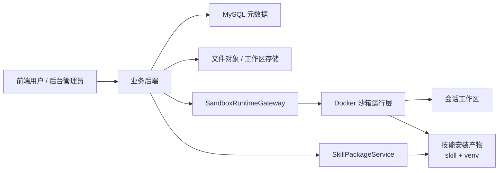

# 技能沙箱执行架构设计文档

**版本**: v1.0  
**日期**: 2026-03-15  
**状态**: 方案设计  
**适用范围**: 当前项目内部可控 Python 技能的沙箱化执行体系

---

## 1. 背景与目标

### 1.1 背景

当前项目已经具备以下基础能力：

1. 技能目录与技能管理后台
2. 技能包导入导出
3. 技能聊天链路与工具动态注入
4. 文件上传与会话管理

但当前 Python 技能执行仍存在明显问题：

1. 技能代码与主后端进程处于同一信任边界
2. Python 依赖安装仍偏共享运行时模式，存在依赖污染风险
3. 文件访问边界过宽，容易触达宿主挂载目录
4. 会话状态、文件状态、执行状态和技能版本之间缺少稳定绑定
5. 缺少独立的运行时治理、日志诊断和失败回溯模型

本项目面向企业私有部署，不考虑 SaaS 多租户公有云场景，因此首要目标不是平台化大规模弹性，而是：

1. 把代码执行边界做清楚
2. 把版本、文件、日志、产物的语义做稳定
3. 让后续技能扩展和后台治理具备可持续性

### 1.2 目标

设计一套面向企业私有部署的技能沙箱执行方案，满足以下目标：

1. 让 Python 技能执行脱离主后端进程信任边界
2. 建立技能版本、会话、工作区、执行记录之间的稳定关系
3. 建立可追溯的文件快照模型与共享文件模型
4. 建立固定输入输出协议，避免执行结果依赖非结构化日志
5. 为后续后台治理、版本下线、日志诊断和运维排障提供基础

### 1.3 设计原则

1. 优先保证隔离边界和可追溯性
2. 优先复用现有项目结构，而不是推翻重做
3. 优先收敛 MVP，避免一次性引入过多平台复杂度
4. 优先让协议稳定，再逐步扩展运行时能力
5. 优先让失败可诊断、可回溯、可治理

---

## 2. 范围与非目标

### 2.1 MVP 范围

本轮设计仅覆盖：

1. Python 技能执行
2. 会话级工作区
3. Docker 沙箱运行模式
4. 技能包导入后的独立 venv 模型
5. 文件快照、共享文件、正式产物与日志诊断模型
6. 技能聊天链路与沙箱执行链路的集成

### 2.2 明确非目标

本轮不覆盖：

1. Python 之外的多语言运行时
2. Kubernetes 生产级编排落地
3. 系统级依赖安装与系统镜像构建平台
4. 外部未适配技能的直接接入
5. 用户级长驻沙箱作为默认模型
6. 在线进入容器调试、实时资源监控大盘等重治理能力

---

## 3. 现状与核心痛点

### 3.1 当前执行模式

结合现有代码，当前技能执行仍主要表现为：

1. `ChatConversationService` 负责技能聊天流式编排
2. `SkillCatalogService` 为技能聊天提供运行时工具回调
3. `ClothingSkillTools.runPythonScript(...)` 使用 `ProcessBuilder` 直接执行 Python
4. `SkillPackageService` 在导入阶段直接处理技能文件与依赖安装
5. 部署层通过 Docker Compose 将 `skills`、`uploads`、`python-runtime` 目录直接挂进后端容器

### 3.2 当前主要问题

1. **执行隔离不足**
   - 技能执行与主后端服务共享进程边界
   - 技能代码的文件访问和运行风险无法被单独收口

2. **依赖隔离不足**
   - 技能之间缺少稳定独立的 Python 依赖环境
   - 运行时污染、版本冲突和排障复杂度高

3. **文件模型不足**
   - 当前上传文件更接近进程内临时对象
   - 缺少稳定的 `file_id / version / file_ref_id` 关系

4. **版本语义不足**
   - 会话与技能版本之间没有稳定绑定模型
   - 老会话、旧版本、版本下线后的历史可追溯能力不足

5. **结果协议不足**
   - 若长期依赖 stdout/stderr 或宿主文件扫描，会导致结果语义不稳定
   - 产物、日志、共享状态容易混淆

---

## 4. 方案选型与推荐结论

### 4.1 会话级 vs 用户级

#### 会话级沙箱

优点：

1. 隔离边界自然，符合聊天产品心智
2. 状态污染范围小
3. 更容易审计、回放、排障
4. 更容易做资源与权限边界控制

缺点：

1. 冷启动频率更高
2. 大缓存复用能力不如用户级

#### 用户级沙箱

优点：

1. 热启动快
2. 缓存利用率高

缺点：

1. 多会话状态污染严重
2. 审计、故障定位和治理复杂
3. 资源容易失控

### 4.2 Docker vs Kubernetes

#### Docker

适合当前阶段：

1. 学习曲线低
2. 足够支撑 MVP 收敛
3. 可以先把执行边界、协议和治理做对

#### Kubernetes

适合后续阶段：

1. 适合更大规模并发和多节点调度
2. 适合后续结合 RuntimeClass、gVisor、Kata 等更强隔离能力

### 4.3 推荐结论

本轮正式推荐方案为：

1. **技能作为打包与版本维度**
2. **会话作为工作区、实例和执行隔离维度**
3. **运行层采用 Docker**
4. **执行环境采用平台基础镜像 + 技能目录 + 技能版本独立 venv**
5. **技能聊天继续复用现有 SSE 壳层，但实际执行链路下沉到独立沙箱执行服务**

---

## 5. 总体架构

### 5.1 总体架构图



### 5.2 分层职责

#### 业务后端

负责：

1. 用户鉴权与角色校验
2. 会话归属和技能版本绑定
3. 文件引用解析
4. 执行记录与产物映射持久化
5. 后台管理接口与用户侧接口

#### 运行层

负责：

1. 容器实例创建、复用、停止
2. 工作区挂载
3. 资源限制
4. launcher 执行
5. 标准日志采集

#### 技能安装产物

负责：

1. 表达技能导入后的稳定可运行版本
2. 向运行层提供只读技能目录与独立 venv

---

## 6. 核心设计概览

### 6.1 核心设计摘要

| 设计点 | 结论 |
|------|------|
| 运行模式 | Docker |
| 隔离粒度 | 会话级 |
| 技能与实例关系 | 技能是版本维度，实例是执行维度 |
| 运行环境 | 平台基础镜像 + 技能目录 + 技能版本独立 venv |
| 工作区模式 | 会话级工作区 |
| 输入协议 | `input.json` |
| 输出协议 | `result.json` |
| 文件引用 | `file_id + version_no + file_ref_id` |
| 日志策略 | 摘要返回 + 全量日志落盘 |
| 网络策略 | 默认完全禁网 |
| 并发策略 | 同会话单执行 |
| 资源限制 | 1 CPU + 1GB |
| 超时 | 60 秒 |
| 工作区容量 | 500MB |

### 6.2 关键设计原则

1. 会话绑定的是 `install_id`，不是模糊版本名
2. 文件引用绑定的是稳定快照，不是“当前最新版本”
3. 共享文件只有在成功执行且显式声明后才进入正式引用空间
4. 失败、超时、取消时保留最小必要现场，但不提交共享变更
5. 旧版本下线后旧会话进入只读态，不允许自动漂移到新版本

---

## 7. 技能包与安装产物设计

### 7.1 技能包最小结构

一个技能包至少应包含：

1. `manifest`
2. `entrypoint`
3. `requirements.txt`
4. `wheelhouse/`
5. `resources/`

### 7.2 安装产物模型

技能包导入成功后形成安装产物，其核心内容包括：

1. 技能目录快照
2. manifest 快照
3. 技能版本独立 venv
4. 安装记录与依赖摘要

### 7.3 导入规则

1. 导入时立即构建 venv
2. 构建失败则整体导入失败
3. 只支持纯 Python 依赖
4. 不支持系统级依赖安装
5. 依赖默认来自离线 wheelhouse 或企业内网源

---

## 8. 会话、版本与实例生命周期

### 8.1 会话模型

1. 一个 `SKILL_CHAT` 会话固定绑定一个 `skillId`
2. 同一 `skillId` 允许多个独立会话
3. 每个会话拥有独立工作区和实例生命周期

### 8.2 版本绑定模型

1. 会话首次执行前绑定一个具体 `install_id`
2. 绑定成功后，不再自动跟随最新版本
3. 若绑定版本被下线，则会话转为 `READ_ONLY`
4. 不支持在原会话里升级到新版本，使用新版本需要新建会话

### 8.3 会话持久状态

`execution_state` 最小取值：

1. `UNBOUND`
2. `RUNNABLE`
3. `READ_ONLY`

### 8.4 实例生命周期

1. 新建会话时不预创建实例
2. 首次执行时懒启动
3. 会话内连续执行默认复用实例
4. 实例空闲 10 分钟自动停止
5. 切换会话时若执行仍在运行，允许其自然结束；结束后停止实例
6. 删除会话时删除工作区

---

## 9. 工作区与文件模型

### 9.1 工作区目录

建议目录结构如下：

```text
workspace/{session_code}/
  uploads/
  session_shared/
  runs/{execution_code}/{run_id}/
    inputs/
    work/
    result.json
    logs/
      stdout.log
      stderr.log
```

### 9.2 目录访问边界

技能默认只允许写：

1. 当前 `run/work`
2. `session_shared`

历史 `run` 目录不默认可读。

### 9.3 文件对象模型

#### `file_id`

逻辑文件线的稳定标识。

#### `version_no`

某个逻辑文件线下的不可变版本号。

#### `file_ref_id`

面向执行输入的稳定快照引用，MVP 默认采用 `file_id@version_no` 编码。

#### `artifact_id`

一次执行内部的产物标识，仅在该次执行内要求唯一。

### 9.4 共享文件规则

1. `session_shared` 中的文件只有在成功执行且被 `result.json` 显式声明后才会进入正式引用空间
2. 失败、超时、取消时不提交共享变更
3. 逻辑删除后允许同一路径复用，但会生成新的逻辑文件线

---

## 10. 执行协议设计

### 10.1 输入协议：`input.json`

平台负责生成 `input.json`，技能只读。最小结构包含：

1. `protocol_version`
2. `session_code`
3. `execution_code`
4. `skill`
5. `arguments`
6. `paths`
7. `files`

输入文件在执行前统一投影到 `run/inputs`，MVP 默认采用复制实现。

### 10.2 输出协议：`result.json`

`result.json` 是唯一主结果协议。最小结构包含：

1. `status`
2. `summary`
3. `data`
4. `artifacts`
5. `shared_updates`
6. `error`
7. `extensions`

### 10.3 协议校验规则

以下情况直接判定执行失败：

1. `result.json` 缺失
2. JSON 非法
3. 必填字段缺失
4. `artifact_id` 冲突
5. 路径越界
6. 声明文件不存在

### 10.4 日志策略

1. `stdout.log` 和 `stderr.log` 由平台自动采集
2. 普通用户默认只看日志摘要
3. 管理员可按执行维度下载全量日志

---

## 11. 数据模型设计

### 11.1 `chat_session` 扩展字段

新增：

1. `bound_install_id`
2. `bound_package_version`
3. `execution_state`

### 11.2 新增 `skill_execution`

用于表达一次技能执行的完整生命周期，包含：

1. 执行编码
2. 会话信息
3. 技能与安装版本
4. 状态
5. 失败阶段
6. 资源限制
7. 结果摘要
8. 开始结束时间

### 11.3 文件对象与版本模型

建议新增：

1. `sandbox_file_object`
2. `sandbox_file_version`
3. `skill_execution_artifact`

其中：

1. `file_id` 表示逻辑文件线
2. `version_no` 表示不可变快照
3. `artifact_id` 只服务当前执行结果视图

---

## 12. 后端模块与接口设计

### 12.1 推荐新增模块

1. `SandboxSessionBindingService`
2. `SandboxExecutionService`
3. `SandboxWorkspaceService`
4. `SandboxFileService`
5. `SandboxRuntimeGateway`
6. `SandboxResultValidator`

### 12.2 与现有模块的关系

#### 保留

1. `ConversationController`
2. `SkillManagementController`
3. 现有 `/skills/chat` SSE 用户交互壳层
4. 现有 `/admin/skills` 后台承载位

#### 替换

1. `ChatConversationService` 的直接宿主执行路径
2. `SkillCatalogService.resolveSkillChatContext(...)` 的直接工具暴露方式
3. `ChatFileService` 的内存文件模型与绝对路径暴露方式

#### 降级兼容

1. `ClothingSkillTools.runPythonScript(...)`
2. 基于真实宿主路径的 `readFile(path)` 执行模式

### 12.3 用户侧接口

在尽量复用现有接口的前提下，新增：

1. `GET /chat/sessions/{sessionCode}/executions`
2. `GET /chat/sessions/{sessionCode}/executions/{executionCode}`
3. `GET /chat/sessions/{sessionCode}/executions/{executionCode}/artifacts/{artifactId}`
4. `GET /chat/sessions/{sessionCode}/files/{fileRefId}`
5. `POST /chat/sessions/{sessionCode}/executions/{executionCode}:cancel`

### 12.4 后台管理接口

建议新增：

1. 安装版本查询与详情接口
2. 安装版本下线 / 启用接口
3. 执行记录检索与详情接口
4. 日志下载接口
5. 会话诊断与实例控制接口

---

## 13. 后台管理设计

### 13.1 菜单承载原则

后台继续沿用现有 `/admin/skills` 作为“技能管理”一级入口，不新增新的顶级侧边栏菜单。

### 13.2 推荐路由结构

1. `/admin/skills`
2. `/admin/skills/:skillId`
3. `/admin/skills/:skillId/installs`
4. `/admin/skills/:skillId/installs/:installId`
5. `/admin/skills/executions`
6. `/admin/skills/executions/:executionCode`
7. `/admin/skills/sessions`

### 13.3 MVP 必备后台能力

1. 查看技能安装版本
2. 下线或启用安装版本
3. 查看执行失败阶段
4. 下载标准日志和正式产物
5. 查看会话绑定版本、只读态和工作区占用

---

## 14. 权限与安全边界

### 14.1 角色划分

1. 普通用户
2. 管理员
3. 业务后端
4. 运行层
5. 技能代码

### 14.2 核心边界

#### 普通用户

允许：

1. 创建自己的技能会话
2. 发起执行
3. 查看自己的执行摘要和正式产物

不允许：

1. 查看其他用户会话
2. 直接下载全量标准日志
3. 下线版本
4. 手动清理任意工作区

#### 管理员

允许：

1. 下线 / 启用安装版本
2. 查看执行记录
3. 下载标准日志
4. 查看会话诊断信息

不默认允许：

1. 在线进入容器
2. 手工篡改 `result.json`
3. 直接修改产物映射

### 14.3 网络与文件安全

1. 沙箱实例默认完全禁网
2. 运行层不直接暴露给浏览器
3. 技能代码不能访问宿主其他目录
4. 技能代码不能访问数据库和主进程内存

---

## 15. 失败与异常处理

### 15.1 失败分类

1. 版本绑定失败
2. 工作区初始化失败
3. 实例启动失败
4. 技能运行失败
5. 执行超时
6. 用户取消执行
7. `result.json` 非法
8. 产物声明非法
9. 同会话并发执行冲突
10. 版本下线后继续执行

### 15.2 统一处理原则

1. 任何失败、超时、取消都不提交 `shared_updates`
2. 任何失败、超时、取消都保留最小必要日志与 `run` 现场
3. 启动失败后的下次重试前必须清理临时运行目录与残留进程
4. 用户提示要区分“可重试”和“需管理员介入”
5. 后台必须能看到精确失败阶段

---

## 16. 关键流程

### 16.1 技能包导入流程

1. 管理员上传技能包
2. 平台解压并校验 `manifest`、目录结构、依赖声明
3. 构建独立 venv
4. 成功则写入安装记录与安装产物
5. 失败则整体导入失败，不保留半可用版本

### 16.2 首次执行流程

1. 用户从技能会话发起执行
2. 会话若未绑定版本，则先绑定 `install_id`
3. 创建执行记录
4. 初始化工作区和输入投影
5. 懒启动会话实例
6. launcher 写入 `input.json` 并执行 entrypoint
7. 平台校验 `result.json`
8. 更新执行记录、产物映射和共享文件

### 16.3 成功执行后的文件提交流程

1. 技能写入 `work/` 和 `session_shared/`
2. 平台校验共享更新是否合法
3. 为正式产物建立产物映射
4. 为共享文件建立新版本快照
5. 用户侧可下载正式产物，后续执行可引用共享快照

### 16.4 版本下线流程

1. 管理员下线安装版本
2. 平台扫描绑定该版本的会话
3. 命中会话统一转 `READ_ONLY`
4. 回收旧实例
5. 保留历史工作区、日志和产物

### 16.5 删除会话流程

1. 用户删除技能会话
2. 平台校验归属并检查运行中执行
3. 若有运行中任务，允许自然结束后再清理
4. 删除工作区与会话主记录

---

## 17. 迁移方案

### 17.1 直接保留

1. 现有会话外壳接口
2. 现有技能包管理接口
3. 前端 `/admin/skills`
4. 前端 SSE 聊天壳层

### 17.2 渐进替换

1. `ChatConversationService`
2. `SkillCatalogService.resolveSkillChatContext(...)`
3. `ChatFileService`
4. `SkillPackageService`

### 17.3 兼容保留

1. `ClothingSkillTools.runPythonScript(...)`
2. 基于宿主真实路径的 `readFile(path)` 模式

### 17.4 推荐迁移顺序

1. 先落表：会话扩展字段、执行记录、文件对象
2. 再稳定导入产物与 `install_id`
3. 再打通最小 Docker 执行主链路
4. 再把聊天链路切换到统一沙箱适配器
5. 再补后台治理和会话诊断

---

## 18. 非功能约束

### 18.1 性能与资源

1. 单次执行默认超时 60 秒
2. 单实例默认限制 1 CPU + 1GB
3. 单会话工作区默认容量上限 500MB
4. 同会话同一时刻只允许一个执行

### 18.2 可观测性

每次执行至少要具备：

1. 执行状态
2. 开始结束时间
3. 失败阶段
4. 日志索引
5. 产物清单
6. 共享变更摘要

### 18.3 审计与追溯

1. 会话必须绑定具体 `install_id`
2. 文件输入必须绑定稳定快照
3. 共享更新必须形成新版本
4. 旧会话即使只读，仍应可追溯

### 18.4 恢复与清理

1. 启动失败后重试前必须清理脏现场
2. 失败、超时、取消时保留最小必要现场
3. 删除会话时删除工作区
4. 旧版本下线后可回收运行时资源，但不能破坏历史查看能力

---

## 19. 术语表

### 19.1 运行与版本

1. `技能包`: 技能分发单元
2. `安装产物`: 技能导入成功后的稳定可运行资源集合
3. `install_id`: 安装产物唯一标识
4. `package_version`: 展示用版本字段
5. `平台基础镜像`: 通用运行镜像
6. `沙箱实例`: 按会话维度创建的容器实例

### 19.2 会话与执行

1. `SKILL_CHAT 会话`: 技能聊天业务单元
2. `execution_state`: 会话级持久执行状态
3. `执行记录`: 一次技能执行留痕
4. `execution_code`: 执行唯一编码
5. `run`: 单次执行现场目录
6. `launcher`: 运行层统一执行器

### 19.3 文件与产物

1. `artifact_id`: 单次执行内的产物标识
2. `file_id`: 逻辑文件线标识
3. `version_no`: 文件快照版本号
4. `file_ref_id`: 面向执行输入的稳定快照引用
5. `session_shared`: 会话级共享目录
6. `逻辑文件线`: 同一路径上的版本链

---

## 20. 附录

### 20.1 相关文档

1. 需求收敛 PRD：`/Users/xiehb/workspace/lingzhou-agent/.trellis/tasks/03-13-skill-sandbox-execution-design/prd.md`
2. 讨论纪要：`/Users/xiehb/workspace/lingzhou-agent/docs/sandbox/skill-sandbox-discussion-record.md`
