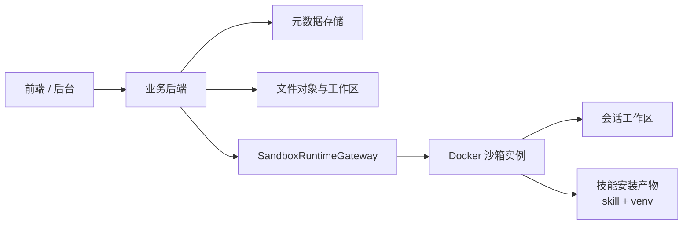

# 技能沙箱执行架构 - 评审摘要

**版本**: v1.0  
**日期**: 2026-03-15  
**状态**: 评审摘要  
**对应详细设计**: `/Users/xiehb/workspace/lingzhou-agent/docs/sandbox/skill-sandbox-architecture-design.md`

---

## 1. 一句话结论

当前项目的 Python 技能执行应从“主后端进程内直接执行”演进为“平台基础镜像 + 技能版本独立 venv + 会话级 Docker 沙箱实例”的模式，先用 Docker 落地 MVP，再为未来向 Kubernetes 演进预留抽象。

---

## 2. 为什么现在必须做

当前模式已经出现明显架构风险：

1. 技能代码与主后端进程共处同一信任边界
2. Python 依赖存在污染与冲突风险
3. 文件路径和工作目录边界不清晰
4. 会话、版本、文件快照、执行记录之间缺少稳定绑定
5. 失败排障、版本下线、历史回放和后台治理能力不足

如果后续继续增加代码执行型技能，而不先做沙箱层，问题会持续放大。

---

## 3. 本轮评审建议拍板的核心结论

### 3.1 总体选型

1. MVP 先采用 `Docker`
2. 只覆盖 `Python 执行 + 文件工作区`
3. 面向企业私有部署，不考虑 SaaS 多租户
4. 当前技能以内部可控为前提，不引入复杂审批流

### 3.2 隔离模型

1. 技能是打包/版本维度，不是运行实例维度
2. 会话是工作区、实例生命周期和执行隔离维度
3. 默认采用 `会话级 sandbox`
4. 不采用 `用户级长驻 sandbox` 作为默认方案

### 3.3 运行环境模型

1. 不采用“一个技能一个完整业务镜像”
2. 采用：
   - `平台基础镜像`
   - `技能目录`
   - `技能版本独立 venv`
   - `会话工作区`
3. 技能包导入成功的标准是：已形成稳定“安装产物”，而不是单纯文件上传完成

### 3.4 生命周期模型

1. 新建 `SKILL_CHAT` 会话时不预创建工作区和实例
2. 首次执行时绑定 `install_id`
3. 实例按会话维度保活，空闲 `10 分钟` 自动停止
4. 切换会话时若执行仍在运行，允许自然结束；结束后停止实例
5. 删除会话时删除工作区
6. 旧版本下线后，会话转 `READ_ONLY`

---

## 4. MVP 范围与明确不做

### 4.1 本轮必须做

1. 会话级工作区
2. 技能版本绑定
3. 独立 venv
4. 固定输入输出协议
5. 文件快照与共享文件模型
6. 执行记录、日志索引、产物映射
7. 后台安装版本、执行记录、会话诊断基础治理能力

### 4.2 本轮不做

1. Kubernetes 落地
2. 多语言运行时
3. 系统级依赖安装
4. 用户级长驻沙箱
5. 在线进入容器调试
6. 外部技能直接接入

---

## 5. 推荐架构摘要

职责分层：

1. 业务后端负责：鉴权、会话绑定、文件引用解析、执行调度、结果校验、元数据持久化
2. 运行层负责：容器生命周期、目录挂载、launcher 执行、日志采集
3. 技能安装产物负责：给运行层提供稳定技能目录与独立 venv

---

## 6. 关键设计决策

### 6.1 会话与版本

1. 一个 `SKILL_CHAT` 会话固定绑定一个 `skillId`
2. 会话首次执行时绑定具体 `install_id`
3. 已绑定会话不自动跟随最新版本
4. 旧版本下线后旧会话只读，不自动切新版本

### 6.2 文件与共享

1. 文件引用采用 `file_id + version_no + file_ref_id`
2. 执行输入绑定稳定快照，不跟随最新版本漂移
3. `session_shared` 只承接成功提交后的共享文件
4. 失败、超时、取消都不提交共享变更

### 6.3 协议

1. 输入固定为 `input.json`
2. 输出固定为 `result.json`
3. `stdout / stderr` 只做日志，不做主结果协议
4. 非法 `result.json` 或非法产物声明直接判定执行失败

### 6.4 资源与限制

1. 单次执行超时 `60 秒`
2. 单实例默认 `1 CPU + 1GB`
3. 单会话工作区上限 `500MB`
4. 同一会话同一时刻只允许一个执行
5. 沙箱默认完全禁网

---

## 7. 状态机摘要

### 7.1 会话持久状态

1. `UNBOUND`
2. `RUNNABLE`
3. `READ_ONLY`

### 7.2 执行状态

1. `PENDING`
2. `STARTING`
3. `RUNNING`
4. `SUCCEEDED`
5. `FAILED`
6. `TIMED_OUT`
7. `CANCELED`

原则：

1. 会话状态只表达“是否可继续按绑定版本执行”
2. 执行状态表达单次运行过程
3. 不把 `RUNNING` 这类瞬时态塞进会话主状态

---

## 8. 数据模型摘要

### 8.1 扩展现有表

`chat_session` 新增：

1. `bound_install_id`
2. `bound_package_version`
3. `execution_state`

### 8.2 新增核心对象

1. `skill_execution`
2. `sandbox_file_object`
3. `sandbox_file_version`
4. `skill_execution_artifact`

核心原则：

1. `install_id` 是版本绑定锚点
2. `file_id` 表示逻辑文件线
3. `version_no` 表示不可变快照
4. `artifact_id` 只在单次执行内有效

---

## 9. 接口与后台治理摘要

### 9.1 用户侧

尽量复用现有：

1. `/chat/sessions`
2. `/skills/chat`

建议补充：

1. 执行历史查询
2. 执行详情查询
3. 执行产物下载
4. 文件快照下载
5. 执行取消

### 9.2 后台侧

继续沿用现有 `/admin/skills` 作为主入口，补：

1. 安装版本列表/详情
2. 版本下线/启用
3. 执行记录中心
4. 日志与产物下载
5. 会话诊断页

---

## 10. 权限边界摘要

### 10.1 普通用户

允许：

1. 发起自己的技能会话执行
2. 查看自己的执行摘要和正式产物

不允许：

1. 查看其他用户会话
2. 直接下载全量运行日志
3. 下线版本或清理任意工作区

### 10.2 管理员

允许：

1. 查看安装版本
2. 下线/启用版本
3. 查看执行记录和标准日志
4. 查看会话诊断

不默认允许：

1. 在线 shell 进入容器
2. 手工篡改执行结果协议

---

## 11. 失败处理摘要

需要重点区分：

1. 绑定失败
2. 工作区初始化失败
3. 实例启动失败
4. 技能运行失败
5. 超时
6. 用户取消
7. `result.json` 非法
8. 产物声明非法
9. 版本下线后继续执行

统一规则：

1. 失败、超时、取消都不提交 `shared_updates`
2. 保留最小必要日志与 `run` 现场
3. 启动失败重试前必须清理临时运行目录和残留进程
4. 后台必须能看到精确失败阶段

---

## 12. 实施建议

### 12.1 推荐分期

1. 先落数据结构：会话扩展字段、执行记录、文件对象/版本
2. 再稳定安装产物：技能目录 + venv + `install_id`
3. 再打通最小 Docker 执行主链路
4. 再切换聊天执行适配器
5. 最后补后台治理能力

### 12.2 迁移原则

保留：

1. 现有会话壳层
2. 现有技能管理入口
3. 现有前端技能管理菜单
4. 现有 SSE 展示外观

替换：

1. 宿主直跑 Python 的执行链路
2. 基于真实路径的文件访问模型
3. 进程内上传文件元数据模型

---

## 13. 当前评审建议

如果本轮要进入评审，建议重点确认以下 5 个点：

1. 是否认可“Docker + 会话级沙箱”作为 MVP 主路线
2. 是否认可“平台基础镜像 + 技能目录 + 独立 venv”而不是“一个技能一个完整镜像”
3. 是否认可“首次执行绑定 install_id，旧会话不自动升级版本”
4. 是否认可“文件引用绑定快照，不跟随最新版本”
5. 是否认可“失败不提交共享变更，但保留最小必要失败现场”

若以上 5 点通过，这份详细设计即可进入研发拆分阶段。

---

## 14. 相关文档

1. 详细设计：`/Users/xiehb/workspace/lingzhou-agent/docs/sandbox/skill-sandbox-architecture-design.md`
2. 需求收敛 PRD：`/Users/xiehb/workspace/lingzhou-agent/.trellis/tasks/03-13-skill-sandbox-execution-design/prd.md`
3. 讨论纪要：`/Users/xiehb/workspace/lingzhou-agent/docs/sandbox/skill-sandbox-discussion-record.md`
